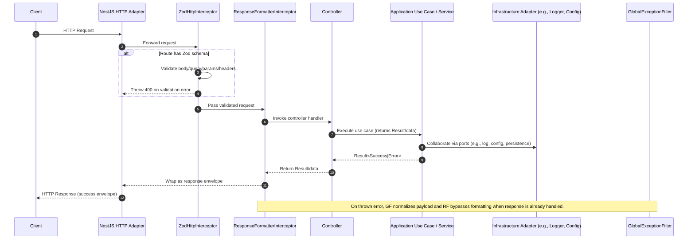
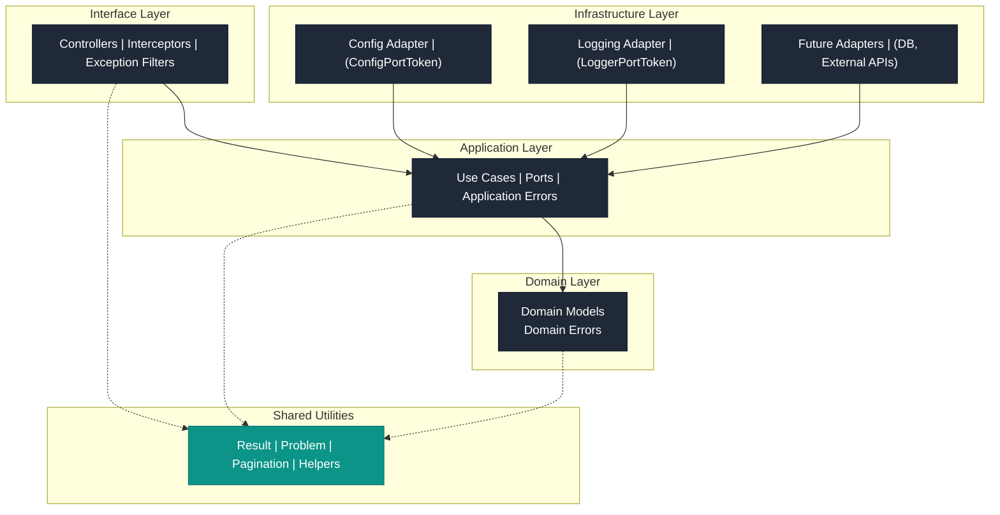

# Shiftroster API Diagrams

This document captures high-level flows and structural relationships in the Shiftroster API using Mermaid diagrams.

## Request Handling Sequence

## Layered Architecture

The architecture diagram emphasizes dependency direction: Interface depends on Application, which depends on Domain. Infrastructure adapters implement the ports defined in the application layer, while shared utilities remain framework-agnostic and can be reused across layers.
